# CourseMaster
Students : 

Arnaud PY (65%) gitid : 'Nonouille'

Tom Simon (15%) gitid : 'TomSim0n'

Rémi Peltriaux (10%) gitid : 'Remsptx'

Bertrand Nagy (10%)

OCC1

# The website
Here is our main page, it will soon contain the lessons will select.
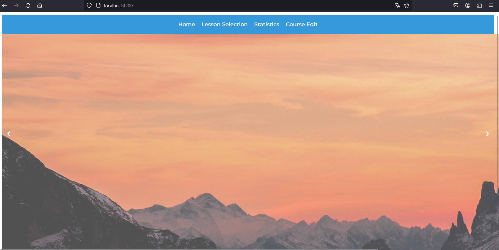
Now let's go to our Lesson Selection page : 
    this page allows us to select any lesson we are interested in and put it directly in the 
main page
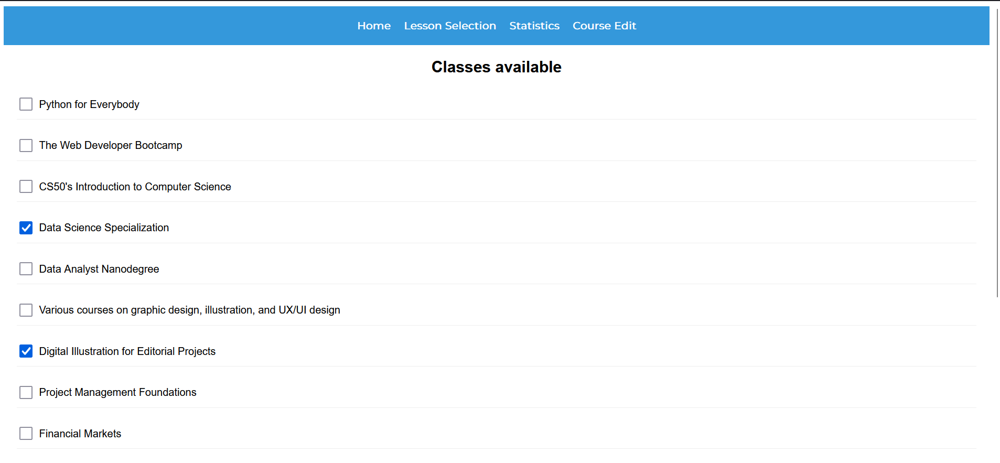
I chose 2 lessons, they now appear in the main page. If I click on them, the next page arrives : 
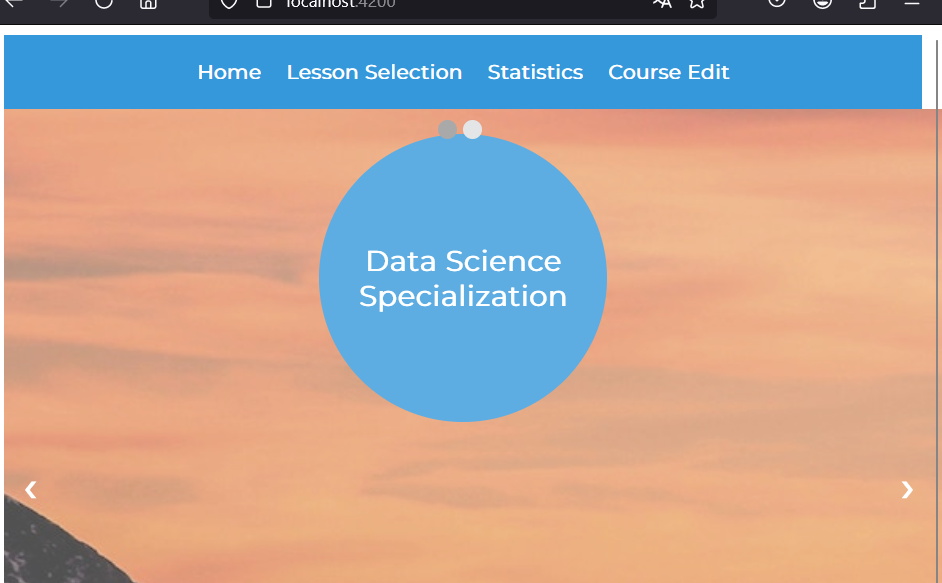
After clicking, we can see the different chapters of the lesson, plus a button to start
the quiz on this same lesson.
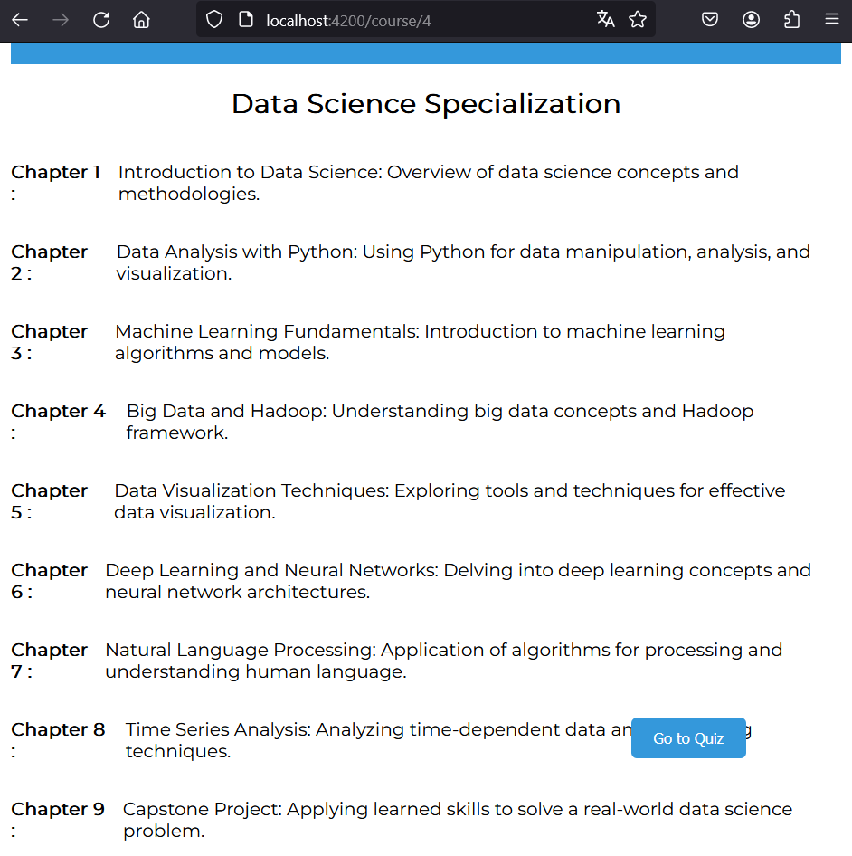
The quiz is a succession of flashcards, where you can click to view the answer
and after seeing it, you can compare it to the answer you wanted to give, and click on
the different levels og understanding: 'Not understood', 'Understanding' and 'Well understood'
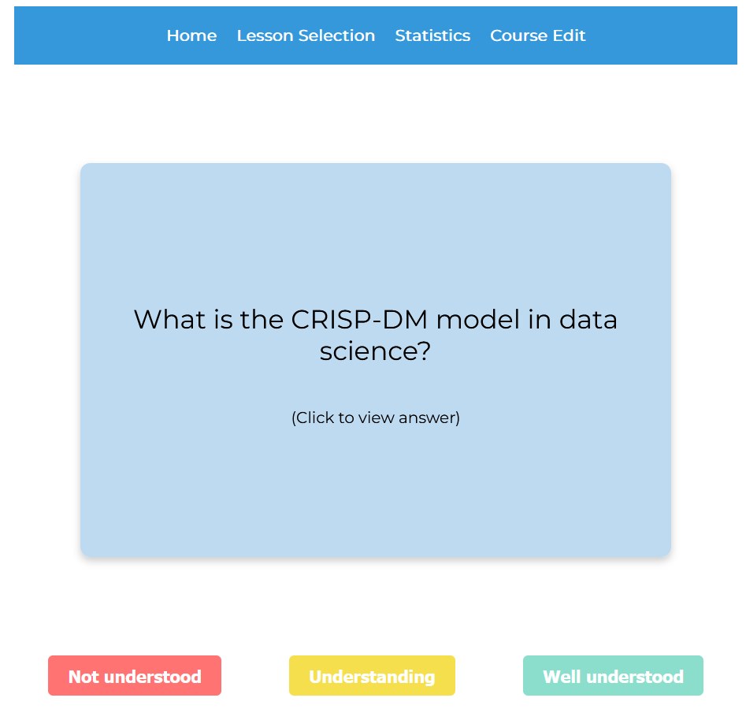
Here is the page when I clicked on the flashcard, we can see the answer appearing.
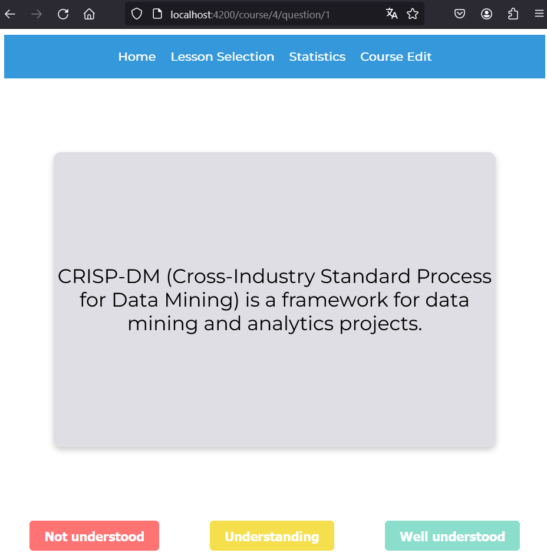
After clicking on one of the 3 buttons below, the next question appears and so on until the end of the quizz.
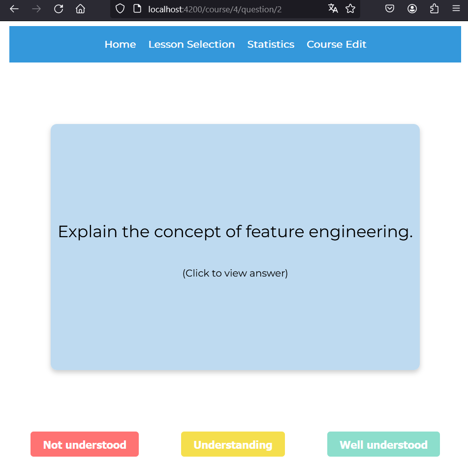
Now the Stats page : it allows the user to see ow many flashcards he saw, and how many he understood or not.
Here is the Stats page right after I answered the first question
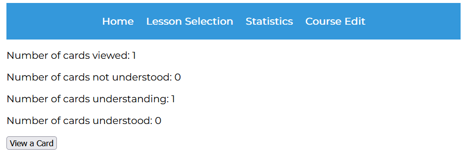
And here is the page after the quiz completion
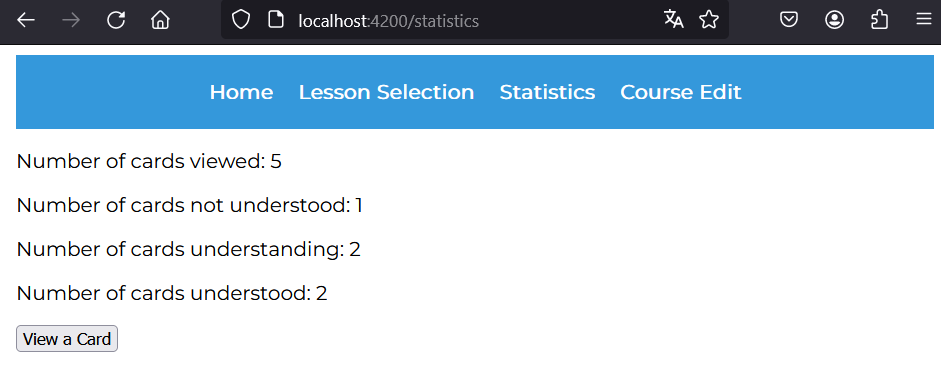
Thr Course edit page allows the user to modify the names of the chapters of a lesson : let's take a look
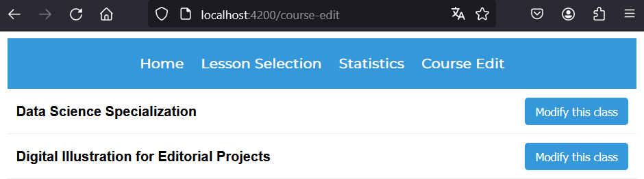
Here I can rewrite any name I want to modify the chapters and then clickon the submit button (bottom left of the screen)
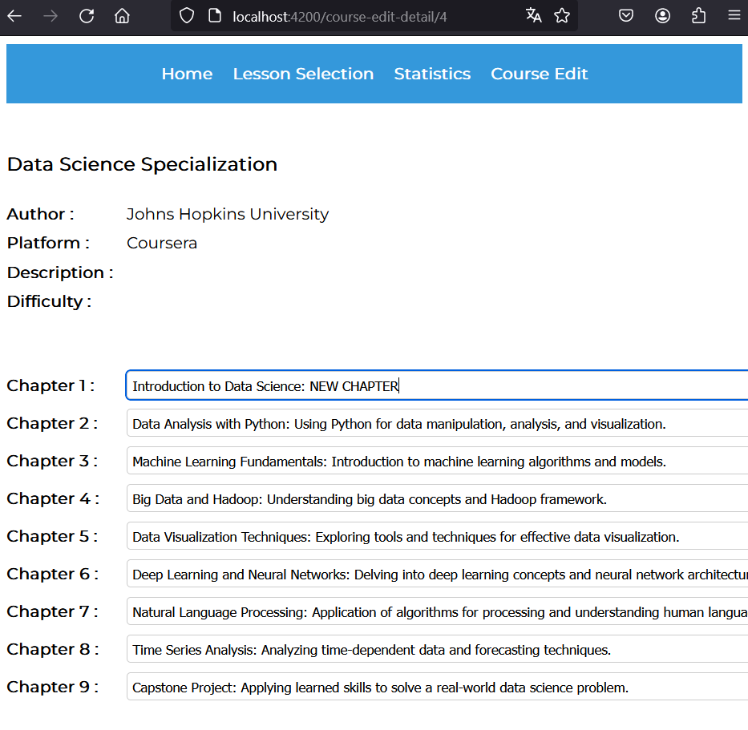